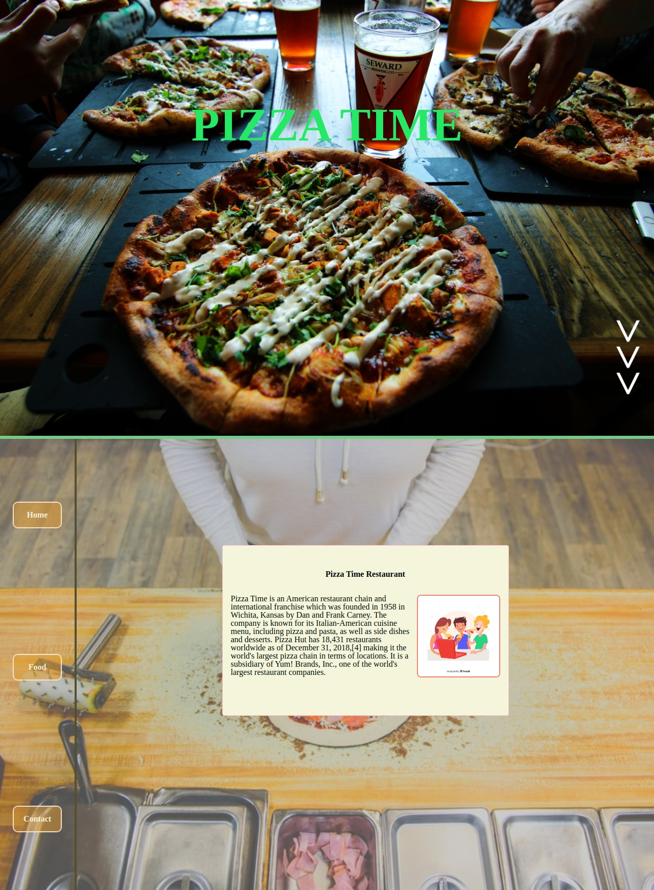

# 💻 Restaurant Page



- Restaurant Page is a webpage design of a **Pizza Restaurant** website in which I implemented a lateral navigation panel that enabe the user to discover different part of the website.

* This design of this project is an assignment that falls under the microverse curriculium:
  - [link to the assignment](https://www.theodinproject.com/courses/javascript/lessons/restaurant-page)


### Technologies Used

In this app we used the following technologies:

HTML | CSS(SASS) | Javascript | Webpack
------------ | ------------- | ----------- | ----------- 
 |  |  | 


## ✨ Live Demo

You can look at it [here](https://rawcdn.githack.com/stratospherique/Restaurant-Page/55d3378c77cde88891db6f6470696973904f0a59/dist/index.html)

## 🚀 Getting Started

To get a local copy up and running follow these simple example steps.

### Clone

```sh
git clone github.com:stratospherique/Restaurant-Page.git
cd Restaurant-Page
```

### Install

```sh
npm install
```

### Usage

```sh
npm start
```

## :pencil2: Todo
- Tests to be added

## Author

:male_detective: Ahmed Mahfoudh

- [Github](https://github.com/stratospherique)
- [Linkedin](https://www.linkedin.com/in/ahmed-mahfoudh/)
- [Twitter](https://twitter.com/AhmedMahfoudh8)
- [Email](mailto:ahmed.mahfoudh1991@gmail.com?subject=Website%20Inquiry)

## 🤝 Contributing

Contributions, issues and feature requests are welcome!

Feel free to check the [issues page](issues/).

## Show your support

Give a ⭐️ if you like this project!

> “There is no exercise better for the heart than reaching down and lifting people up.”
John Holmes
